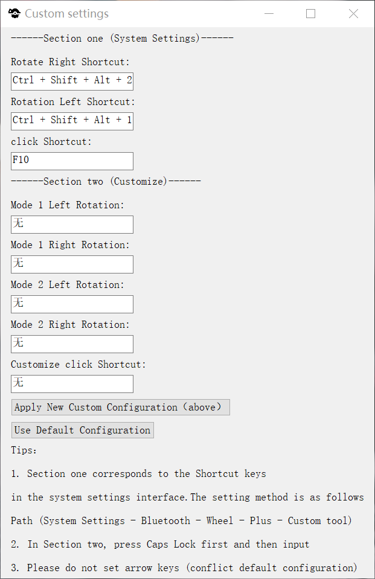

# Surface Dial Settings

[English](https://github.com/Sekai219/Surface-Dial-settings/blob/main/README.md) | [中文简体](https://github.com/Sekai219/Surface-Dial-settings/blob/main/zh_cn.md)

**Surface Dial Settings** 

It is a software that uses Surface Dial to simulate keyboard and mouse operations. It provides customized shortcut keys and custom menus, allowing you to customize the functions of Surface Dial, allowing you to switch between different modes and provide various Actions are assigned different keyboard shortcuts.

## Preview

## Features

- **Hotkey Functions**:
  - **Left Rotation**: Custom or default keys based on settings
  - **Right Rotation**: Custom or default keys based on settings
  - **Double Click**: Toggles the mode 1/2 state and displays a status notification. You can turn off the toggle notification in the settings.
  - **Single Click**: Custom or default keys based on settings

## Installation and Usage

1. **Download**:
   - Download the `.exe` file from the [release page].

2. **Run**:
   - Double-click the downloaded `.exe` file to start the application.

3. **Tray Menu Operations**:
   - Right-click on the system tray icon to access the menu options.

4. **Hotkey Operations**:
   - Use the Surface Dial's press and rotation as well as double-clicking to operate.

5. **Preparation**:（Default mode ）
   - In the device settings under the "Dial" options, set the default tool's right rotation shortcut to **Ctrl + Alt + Shift + 1**.
   - Set the default tool's left rotation shortcut to **Ctrl + Alt + Shift + 2**.
   - Set the single click to **F10**. These keys can be replaced by the user by setting.

## Compiler

If you need to compile the script yourself, ensure that [AutoHotkey](https://www.autohotkey.com/) is installed on your system, and follow these steps:

1. Save the script as a `.ahk` file.
2. Use the AutoHotkey compiler to compile the script into an `.exe` file.

## Notes

- The functionality of the script may be affected by system settings or other programs.
- Make sure to understand all the hotkeys and features before using the script.

## Contribution

If you have any suggestions or find any bugs, please report them or contribute code. Contributions are welcome!

## Contact

- Author: Sekai
- [Email](mailto:qq1973846900@gmail.com)
- [GitHub](https://github.com/Sekai219)

END
