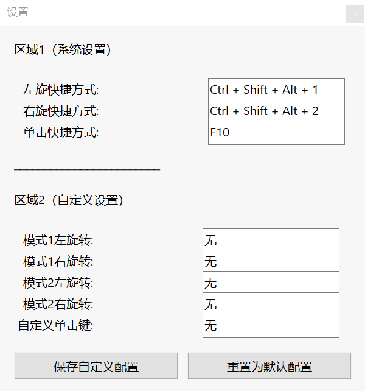

# Surface Dial Settings

**Surface Dial Settings** 是一个使用Surface Dial用于模拟键盘和鼠标操作的软件，提供了自定义的快捷键和托盘菜单功能。

## 预览

## 功能

- **快捷键功能**：
  - **左旋转**：根据脚本状态发送左箭头键或向上滚动。
  - **右旋转**：根据脚本状态发送右箭头键或向下滚动。
  - **双击**：切换脚本的启用/禁用状态，并显示状态提示，可在设置通知中关闭切换提醒。
  - **单击**：空格键/暂停键。
- **托盘菜单**：
  - **Surface Dial Settings**
  - **暂停热键**：暂停热键功能。
  - **暂停脚本**：暂停脚本的所有功能。
  - **退出脚本**：退出脚本并关闭程序.

## 安装与使用

1. **下载**：
   - 从[发布页面]下载 `.exe` 文件。

2. **运行**：
   - 双击下载的 `.exe` 文件以启动软件。

3. **托盘菜单操作**：
   - 右键单击系统托盘中的图标以访问菜单选项。

4. **快捷键操作**：
   - 使用Surface Dial的按压和旋转以及双击来进行操作。

5. **需要事先准备的工作**：
   - 打开设备设置中的“轮盘”选项，将默认工具的右旋快捷方式设置为 **Ctrl + Alt + Shift + 1**。
   - 将默认工具的左旋快捷方式设置为 **Ctrl + Alt + Shift + 2**。
   - 将单击设置为 **F10**，以上按键可以通过用户自己编译替换。

## 编译

如果你需要自行编译脚本，请确保你的系统中已安装 [AutoHotkey](https://www.autohotkey.com/)，然后使用以下步骤：

1. 将脚本保存为 `.ahk` 文件。
2. 使用 AutoHotkey 编译器将脚本编译为 `.exe` 文件。

## 注意事项

- 脚本的功能可能会受到系统设置或其他程序的影响。
- 使用脚本前请确保了解所有快捷键和功能。

## 贡献

如果你有任何建议或发现了 bug，请提交问题或贡献代码。欢迎参与改进！

## 联系方式

- 作者：Sekai
- [电子邮件](qq1973846900@gmail.com)
- [GitHub](https://github.com/Sekai219)
